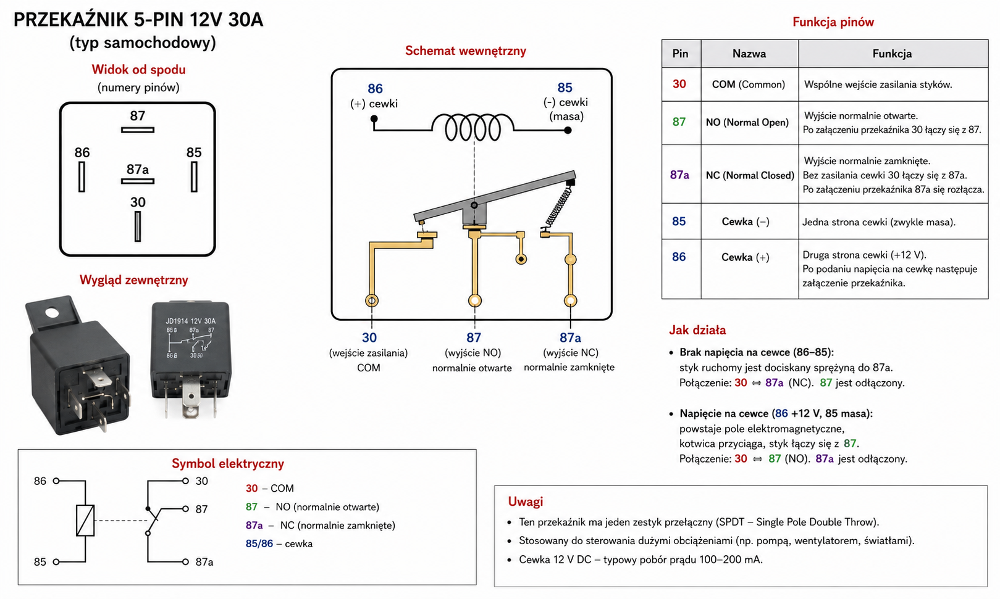
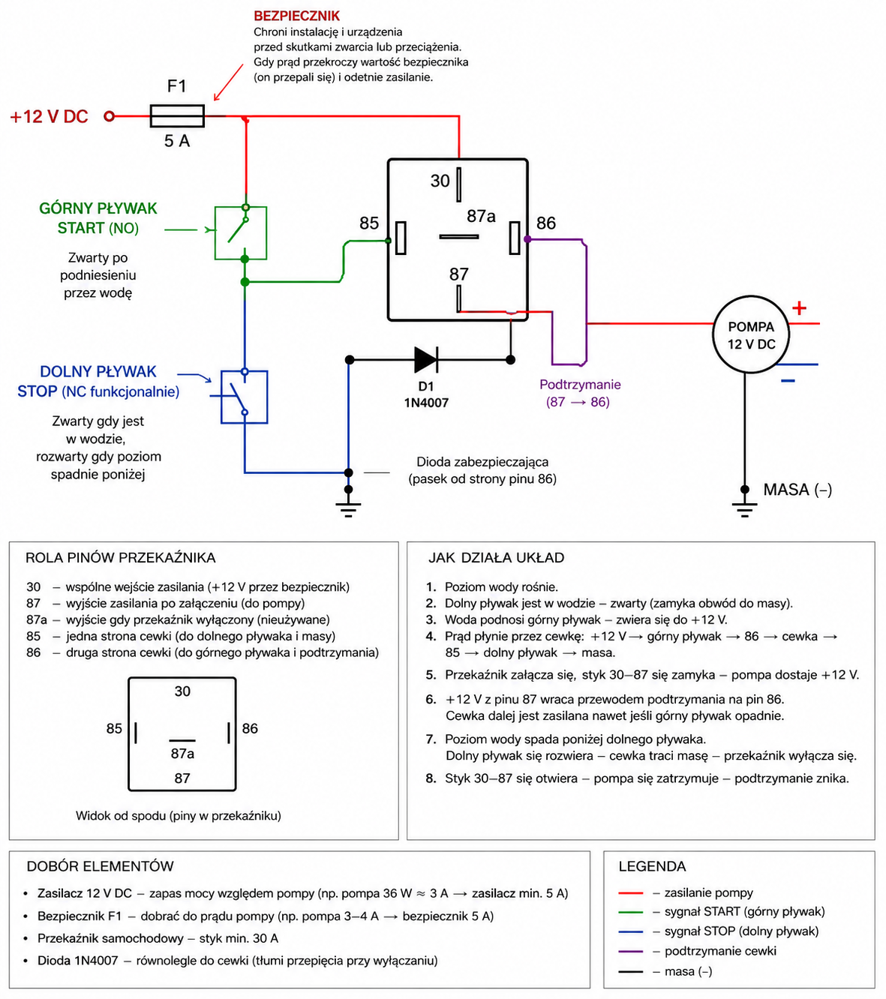
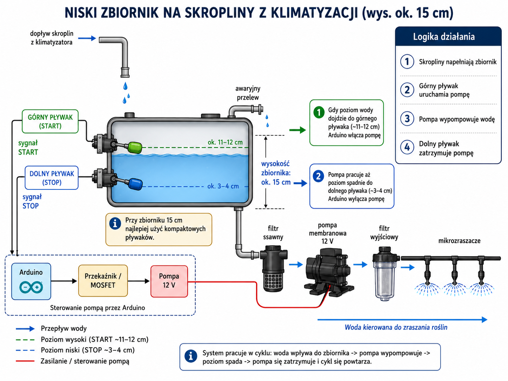

# Condensate drainage automation

Projekt automatycznego odprowadzania skroplin z niskiego zbiornika przy klimatyzatorze. Założenie robocze: pompka 12 V DC uruchamia się po osiągnięciu górnego poziomu wody i pracuje do chwili, gdy poziom spadnie poniżej dolnego czujnika.

## Status projektu

Projekt jest na etapie koncepcji, doboru elementów i symulacji układu sterowania. Parametry elektryczne pompy, bezpiecznika i przekaźnika są obecnie wartościami przybliżonymi i powinny zostać zweryfikowane po wyborze konkretnych części.

## Zasada działania

Układ wykorzystuje dwa boczne przełączniki pływakowe oraz samochodowy przekaźnik 12 V ze stykiem przełącznym:

1. Górny pływak zwiera obwód cewki przy wysokim poziomie i uruchamia przekaźnik.
2. Styk NO przekaźnika zasila pompę oraz przewód samopodtrzymania prowadzący z pinu 87 do 86.
3. Po opadnięciu górnego pływaka pompa nadal działa dzięki samopodtrzymaniu.
4. Dolny pływak jest zwarty, gdy znajduje się w wodzie. Po spadku poziomu rozwiera powrót cewki do masy.
5. Przekaźnik puszcza, styk 30–87 się rozłącza, a pompa i samopodtrzymanie zostają wyłączone.

## Potencjalne elementy

| Element rzeczywisty | Wstępne założenie | Odpowiednik w symulacji |
|---|---|---|
| Zasilacz DC | 12 V, wydajność prądowa dobrana do pompy i prądu rozruchowego | Źródło napięcia DC `12 V` |
| Pompka membranowa / opryskiwacza | 12 V DC, orientacyjnie 2–3 A podczas pracy, chwilowo więcej przy rozruchu | `DCMotor`: L = 5 mH, R = 2 Ω, K = Kb = 0,03, J = 0,001 kg·m², b = 0,002 Nms/rad, przełożenie 1 |
| Przekaźnik samochodowy SPDT | Cewka 12 V, piny 30, 87, 87a, 85, 86 | `Relay`: L = 0,2 H, rezystancja cewki 80 Ω, próg załączenia 0,02 A, styk ON 0,05 Ω, OFF 1 MΩ |
| Górny przełącznik pływakowy | Funkcja START; zwiera przy wysokim poziomie | Przełącznik ręczny `Górny pływak` |
| Dolny przełącznik pływakowy | Funkcja STOP; zwarty w wodzie, rozwiera przy niskim poziomie | Przełącznik ręczny `Dolny pływak` |
| Dioda przy cewce | Zwykła dioda prostownicza, np. 1N4007; pasek do pinu 86 | Dioda równolegle do cewki, przewodząca z 85 do 86 podczas wyłączania |
| Bezpiecznik | Wstępnie samochodowy 5 A; ostatecznie dobrać do danych pompy | `Fuse`: R = 0,02 Ω, I²t = 60 A²s — parametr dobrany tak, aby uproszczony model CircuitJS nie przepalał się przy normalnej pracy silnika |
| Zbiornik | Niski zbiornik, około 15 cm wysokości, z dwoma pływakami bocznymi | Nie jest odwzorowany elektrycznie; poziom wody symulują dwa przełączniki |
| Wąż, zawór zwrotny, dysze | Dobór zależny od wydajności i ciśnienia pompy | Brak modelu hydraulicznego w CircuitJS |

## Symulacja CircuitJS

Model znajduje się w pliku:

`simulation/condensate-drainage-circuitjs.txt`

Można go otworzyć w [CircuitJS](https://www.falstad.com/circuit/circuitjs.html):

1. Otwórz **File → Import From Text**.
2. Wklej zawartość pliku.
3. Zamknij dolny pływak, aby zasymulować obecność wody.
4. Zamknij górny pływak, aby uruchomić pompę.
5. Ponownie otwórz górny pływak — pompa powinna nadal pracować dzięki samopodtrzymaniu.
6. Otwórz dolny pływak — pompa powinna się zatrzymać.

Model silnika odwzorowuje jedynie część elektryczno-mechaniczną. Nie symuluje przepływu, ciśnienia, wysokości podnoszenia, pracy membrany ani oporów instalacji wodnej.

## Schematy poglądowe

> **Uwaga:** wszystkie poniższe obrazy zostały wygenerowane przez AI. Są wyłącznie materiałem poglądowym i mogą zawierać nieścisłości, uproszczenia lub błędy. Przed wykonaniem rzeczywistej instalacji należy oprzeć się na zweryfikowanym schemacie elektrycznym, dokumentacji wybranych elementów i pomiarach.

### Ogólny widok systemu

### Poglądowy schemat połączeń

### Niski zbiornik na skropliny

## Ważne ograniczenia i bezpieczeństwo

- Układ pracuje na 12 V DC, ale zasilacz sieciowy 230 V musi być zamontowany w suchym i bezpiecznym miejscu.
- Elementy elektryczne należy zabezpieczyć przed wodą i kondensacją.
- Pływaki nie powinny przełączać prądu pompy; sterują wyłącznie cewką przekaźnika.
- Bezpiecznik należy umieścić możliwie blisko dodatniego wyjścia zasilacza.
- Należy zweryfikować rzeczywisty prąd roboczy i rozruchowy pompy przed doborem zasilacza, przewodów, bezpiecznika i przekaźnika.
- Warto przewidzieć awaryjny przelew lub alarm wysokiego poziomu na wypadek awarii pompy albo zatkania przewodu.
